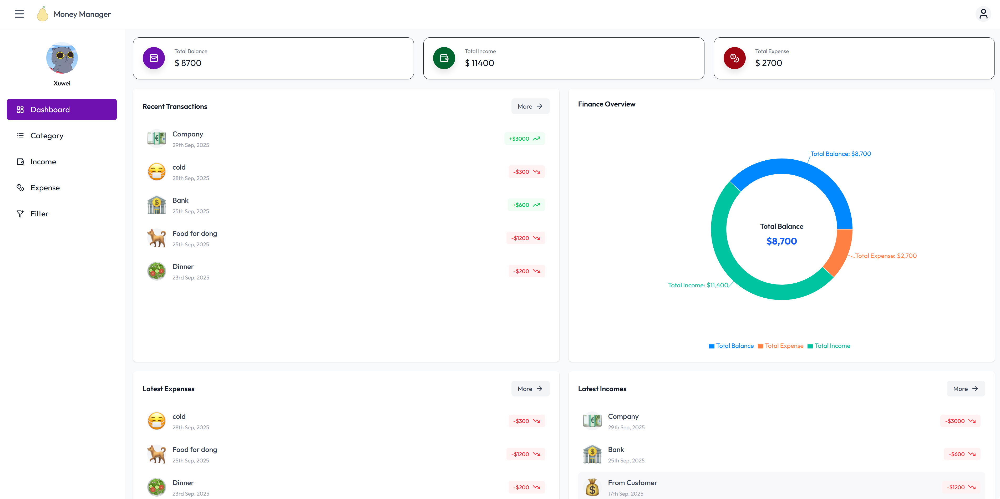
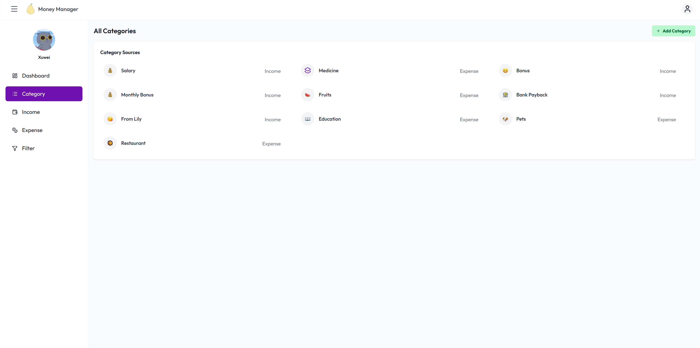
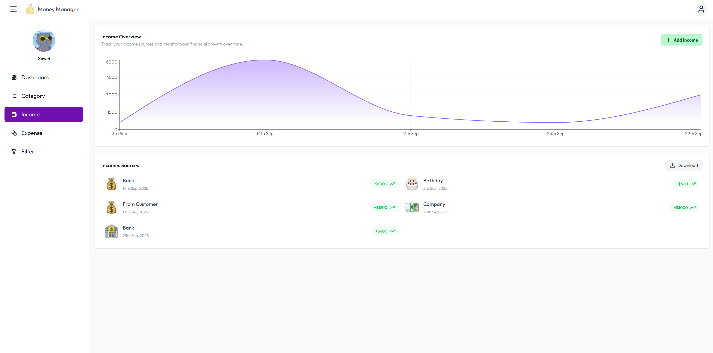
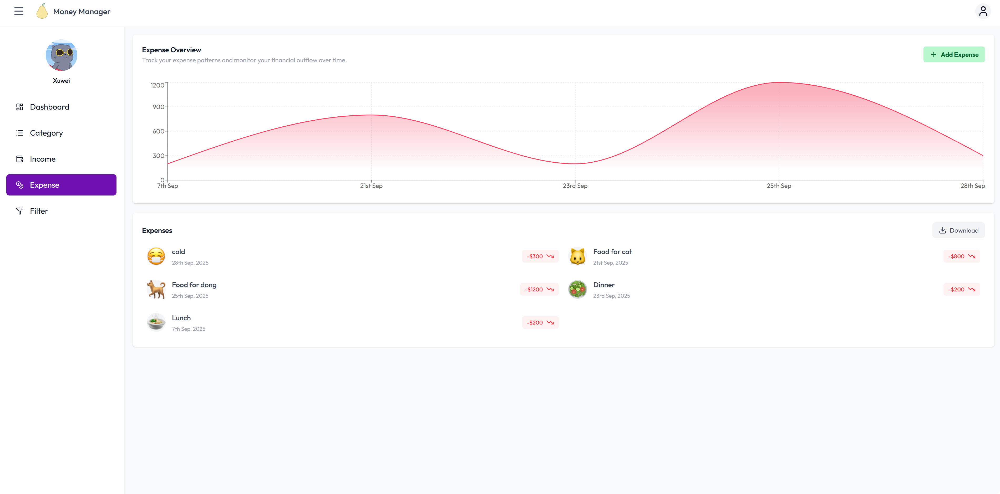
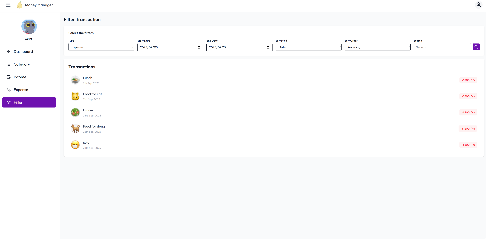

# 💰 Income & Expense Manager

A full-stack personal finance management system built with **React.js + Tailwind CSS** for the frontend and **Spring Boot + Spring Data JPA + MySQL** for the backend.  
This project demonstrates a **modular architecture**, **secure authentication with JWT**, **RESTful API integration**, and **data visualization with charts**.

---

## 🌟 Technology Stack

### Backend
- **Framework:** Spring Boot 3.5.6  
- **Security:** Spring Security with JWT Authentication  
- **ORM:** Spring Data JPA  
- **Database:** MySQL  
- **Build Tool:** Maven  
- **Other:** Java 17+, Excel Export (Apache POI)

### Frontend
- **Framework:** React.js (Vite setup)  
- **Styling:** Tailwind CSS  
- **State Management & Routing:** React Router, Context API  
- **UI & UX Enhancements:** Lucide React (icons), React Hot Toast (notifications), Emoji Picker  
- **Charts & Visualization:** React Charts  

### Communication
- **Frontend ↔ Backend:** RESTful API (Axios for HTTP requests)  

---

## 🏗 Architecture Overview

1. **User Layer (Frontend)**  
   - Developed with React.js + Tailwind CSS  
   - Features: Registration/Login, Income & Expense management, Dashboard, File export, Notifications  
   - Responsive design with mobile-first approach  

2. **Application Layer (Backend)**  
   - Spring Boot for application logic and API endpoints  
   - Spring Security with JWT for authentication & authorization  
   - Scheduled tasks for daily reminders  

3. **Data Layer**  
   - MySQL as the primary relational database  
   - Spring Data JPA for persistence and repository management  
   - Validation and error handling on entity level  

4. **Integration Layer**  
   - RESTful APIs for communication between frontend and backend  
   - Excel generation via Apache POI  
   - Cloudinary for storing profile pictures  

---

## 🔧 Features

- ✅ **User Authentication:** Register with email verification & secure login (JWT)  
- ✅ **Transaction Management:** Add, update, and validate income & expense records  
- ✅ **Category Management:** Create and organize income/expense categories  
- ✅ **Dashboard & Analytics:** Interactive charts and statistics with React Charts  
- ✅ **Filtering & Search:** Advanced filtering for transactions and categories  
- ✅ **Profile Management:** Upload profile pictures to Cloudinary  
- ✅ **Export & Sharing:** Download transactions as Excel 
- ✅ **Notifications:** Real-time notifications

---

---
## 📸 Screenshots

### 1. Dashboard
<div align="center">
  
</div>

### 2. Category
<div align="center">
  
</div>

### 3. Income
<div align="center">
  
</div>

### 4. Expense
<div align="center">
  
</div>

### 5. Filter
<div align="center">
  
</div>

## 🛠 Installation & Setup

### Backend (Spring Boot)
```bash
# Navigate to backend folder
cd backend

# Configure database (MySQL) in application.yml
spring.datasource.url=jdbc:mysql://localhost:3306/income_expense_db
spring.datasource.username=your_username
spring.datasource.password=your_password

# Run the backend
mvn spring-boot:run

# Navigate to frontend folder
cd frontend

# Install dependencies
npm install

# Start development server
npm run dev
```


